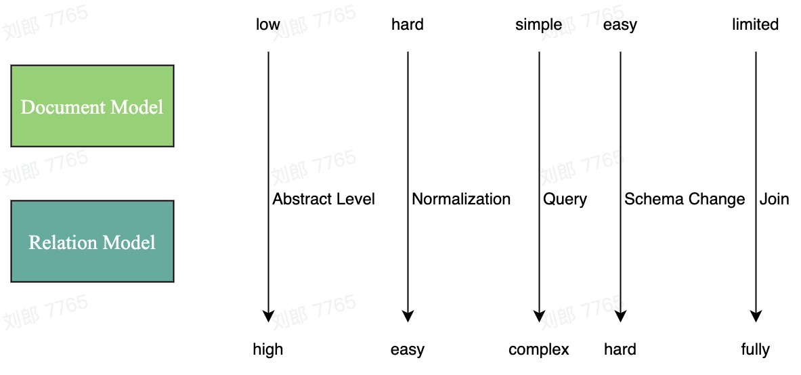

---
presentation:
  width: 1200
  height: 800
  theme: solarized.css
  enableSpeakerNotes: true
---

<!-- slide data-notes="Write your note here" -->

### DDIA Series

## Introduction to Data Models

#### 2023-03-14
#### Lang Liu

<!-- slide -->

## Topics

- Data Models
  - Hierarchical model: IBM IMS - Apollo's choice
  - Relational Model: The most widely used
  - Network Model: Relational Model's Competitor in 1970's
  - Document Model: Revived in late 2000s
  - Graph-like Model: Killer Utility in Specific area
- Comparision
- Query Languages

<!-- slide vertical=true -->

```text
Generated by ChatGPT
Hint: Draw ascii picture to show the timeline of relational model, document model and network model, includes all the up and downs of their usage

   ____________         _________________        _____________
  |  Network   |------>|  Document Model  |------>| Relational |
  |   Model    |   /|\ |     (1960s)     |  /|\   |   Model   |
  |(Dominant 60s)|  |  | (Dominant 60s-80s) |  |    |(Dominant) |
  |____________|  |  |___________________|  |    |___________|
                   |                         |  
                   |_______          ________|      
                           |        |             
                           |________|             
                               |
                               |(Ups and downs)      
                               |
   _____________________   ____________   _____________________
  |    Object-Oriented   | |  Key-Value   | |    Document Store    |
  |     Databases       | |   Databases  | |     Databases        |
  |(1980s-Present day)  | |(Late 2000s)  | | (2007-Present day)   |
  |_____________________| |_____________| |_____________________|

```

<!-- slide -->

## Choose the Right Model

##### Is the right model really exists?


<!-- slide vertical=true -->

## How to measure data model

- leads to simpler application code
- flexible enough on schema change

#### Other concerns

- ACID, more related to the database implementation

<!-- slide -->

## Document Model

- Join is not supported
- Schema-on-read

<!-- slide -->

## Join is not supported

- Denormalize - duplicate data, make future changes hard
- Normalize - programmers write code to resolve references manually

##### while it's not true for MongoDB, it does have limitations

- MongoDB's transactions is supported after 4.0 released in 2018
- MongoDB's transactions don't work on Standalone Deployment

<!-- slide -->

## Schema on read

Add firt_name column

```java
if (user && user.name && !user.first_name) {
  // Documents written before Dec 8, 2013 don't have first_name
  user.first_name = user.name.split(" ")[0];
}
```

<!-- slide -->

## Relational Model

- Object-Relational Mismatch
- Slow Online DDL

<!-- slide -->

## Object-Relational Mismatch

```text
Generated by ChatGPT
Hint: try to use ascii picture to describe how hibernate implement relation object mapping in java, take one to many relationship as an example. make parent and child relationship more apparent. Draw objects and tables in the same table

+-------------------------------+        +----------------+ 
|          Parent Object        |        | Parent Table   |
+-------------------------------+        +----------------+
| ID: 1                         |        | ID: 1          |
| field1: "Parent field1 value"|   ┌───►| field1: "..."  |
|          .                    |   |    +----------------+
|          .                    |   |
| childObjects: [Child Object]  |   |    +----------------+ 
+-------------------------------+   |    | Child Table    |
        | One-to-Many              |    +----------------+
        |                          |    | ID: 1          |
        |                          |    | ParentID: 1    |
+-------------------------------+   |    | field1: "..."  |
|          Child Object         |   └───►+----------------+
+-------------------------------+
| ID: 1                         |
| ParentID: 1                   |
| field1: "Child field1 value"  |
|          .                    |
|          .                    |
+-------------------------------+
```

<!-- slide vertical=true -->

## More Concerns in ORM

<!-- slide vertical=true -->

### Lost Update


##### Dynamic Update comes for rescue?

<!-- slide vertical=true -->

### Dynamic Update with Mystery


<!-- slide vertical=true -->

## Other Frameworks

#### Semi-ORM

- Mybatis

#### Better SQL with Type-safe

- JOOQ
- Query DSL

<!-- slide -->

## Slow online DDL

Add firt_name column

```sql
ALTER TABLE users ADD COLUMN first_name text;
UPDATE users SET first_name = split_part(name, ' ', 1);      -- PostgreSQL
UPDATE users SET first_name = substring_index(name, ' ', 1);      -- MySQL
```

<!-- slide vertical=true -->

###### Although online ddl is supported on many operations in MYSQL
###### But some of them - like change the type of a column is not covered


<!-- slide vertical=true -->

Take Mysql Read/Write Replication Structure into account (each node is deployed with master-slave replication for HA).

```text
 Generated by ChatGPT
            +-------------------+
            |     Application   |
            +-------------------+
                    |
            +-------+-------+
            |MySQL Load Balancer|
            +-------+-------+
                    |
+-------------------+-------------------+
|      Read/Write MySQL Nodes            | 
+-------------------+-------------------+
                    |
+----------------------------------------+
|          Read-Only MySQL Nodes          | 
+----------------------------------------+
                    |
+-----+-----+-----+-----+-----+-----+-----+-----+
|MySQL|MySQL|MySQL|MySQL|MySQL|MySQL|MySQL|MySQL|
|Node |Node |Node |Node |Node |Node |Node |Node |
|Read-|Read-|Read-|Read-|Read-|Read-|Read-|Read-|
|Only |Only |Only |Only |Only |Only |Only |Only |
+-----+-----+-----+-----+-----+-----+-----+-----+
```

<!-- slide vertical=true -->

### Final Solution

- 1 close MySQL binary log in current session

```sql
SET sql_log_bin = 0;
-- run the query here that you want to exclude from binary logging
SET sql_log_bin = 1;
```

- 2 use pt-online-schema-change util in Percona Toolkit to modify column type on the air, it works in following steps:
  - creates a new table with the required column type
  - copies the data to the new table
  - synchronizes the data between the old and new tables
  - once synchronization is complete, the tool swaps the tables in a non-blocking way

<!-- slide -->

## Comparision



<!-- slide -->

## Dessert: relationship of languages


<!-- slide -->

## What's More - About ORM & OOP

<!-- slide vertical=true -->

### [Hibernate (represented ORMs) is the Vietnam of Computer Science](https://www.odbms.org/wp-content/uploads/2013/11/031.01-Neward-The-Vietnam-of-Computer-Science-June-2006.pdf)

- By Ted Neward - author of Effective Enterprise Java, C# in a nutshell, Professional F# 2.0

<!-- slide vertical=true -->

### [Hibernate (represented OOP thoughts) is the Gorilla Holding the Banana](https://www.johndcook.com/blog/2011/07/19/you-wanted-banana/)

- By Joe Armstrong - creator of Erlang


<!-- slide -->

## The END
