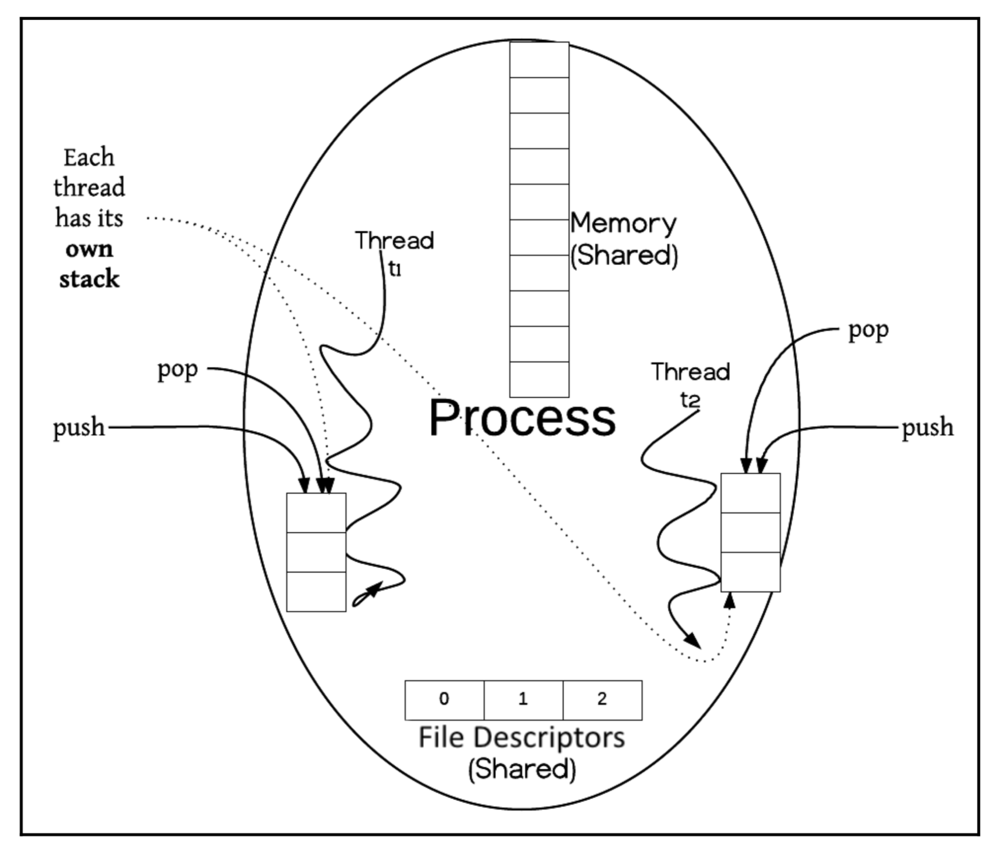

# Concurrency - An Introduction

简单介绍了并发编程的两个模型

- Message passing model
- Shared memory and shared state model

讨论消息传递模型时主要关注点放在进程（Process），指出各进程维护自己状态，不关心其它进程状态，不同进程在一个明确的 message channel 进行交流。

讨论共享内存模型时主要关注点放在线程（Thread），指出多个线程在同一进程中，有着共享内存用于共同存储状态。

## 1 Concurrency in a breeze

When things happen at the same time, we say that things are happening concurrently.

### 1.1 The push for concurrency

The central infrastructure themes are horizontal versus vertical scaling.

- Horizontal scaling essentially implies the use of a distribettes concurrency pattern; it's cost effective. and a prominent idea in the big data world.

Two common concurrency themes for horizontally scaled systems

- The Map Reduce Pattern
- Fault tolerance

### 1.2 Time sharing

A CPU shares time with processes(running programs), this is how concurrency gets supported on a single CPU.

### 1.3 Two models for concurrent programming

- The message passing model
- Shared memory approach

## 2 The message passing model

### 2.1 Coodination and communication

The ability of the framework to be composed of smaller parts without the parts themselves being aware of the composition is a great design pattern, called pipes and filters. Composition is one central theme, yielding robust concurrent programs.

## 2.2 Flow control

Process's life cycle

```text
              ==========================>
start => scheduled <================= running => done
                            <============
              <=====  waiting for I/O
```

## 2.3 Divide and conquer

Principle: a parallelizable job is split into pieces, each of which is processed in parallel (thereby overlapping processing and reducing the time).

## 2.4 The concept of state

Each process has its own state by design, and this state is hidden from other processes. The processes communicate with explicit messaging channels.

Two key point:

- A process mantains only it's state, and don't care about other process's.
- A global shared memory could be used as a explicit messaging channel.

# 3 The shared memory and shared state model

A thread of execution is a sequence of programming instructions, scheduled and managed by the operating system. A process could contain multiple threads; in other words, a process is a container for concurrently executing threads.



## 3.1 Thread interleaving - the need for synchronization

Factors such as the system load, the number of processes at a time on the machine, make thread scheduling unpredictable.

Every java object has a lock. A thread acquires it, performs the state mutations, and unlocks. This entire sequence is a **critical section**.

Critical section need to be kept as small as possible.

## 3.2 Race conditions and heisenbugs

Race conditions means that the correctness of the program depends on the relative timing of the threads getting scheduled. So sometimes it works right, and sometimes it does not!

And race conditions produce heisenbugs.

## 3.3 Correct memory visibility and happens-before

The **synchronization** keyword not only prevents the execution of critical sections by more than one thread, but also makes sure that the thread's local memory syncs up correctly with the shared memory.

On a multicore CPU, each CPU has a cache for performance reasons. This cache needs to be synced with the main shared memory.

- Wnen a thread exits a synchronized block, it issues a write barrier, thereby syncing the changes in its cache to the shared memory.
- When a thread enters a synchronized block, it issues a read barrier, so its local cache is updated with the latest changes in the shared memory.
