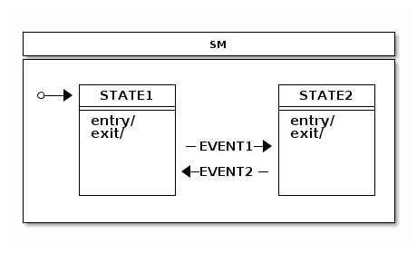

# Spring State Machine Appendices

## Appendices A: Support Content 支撑材料

此附录提供了关于本参考文档中使用到的 Java 类和相关材料的信息。

### Classes Used in This Docunment 文档中用到的类

下面列出了本参考文档中出现的类：

```java
public enum States {
  SI,S1,S2,S3,S4,SF
}
```

```java
public enum States2 {
  S1,S2,S3,S4,S5,SF,
  S2I,S21,S22,S2F,
  S3I,S31,S32,S3F
}
```

```java
public enum States3 {
  S1,S2,SH,
  S2I,S21,S22,S2F
}
```

```java
public enum Events {
  E1,E2,E3,E4,EF
}
```

## Appendices B: State Machine Concepts 状态机概念

此附录提供了关于状态机的一些通用信息。

### Quick Example 快速上手实例

假设我们有 `STATE1` 和 `STATE2` 两个状态和 `EVENT1` 和 `EVENT2` 两个事件，状态机的逻辑可以按下图所示来定义：



下面的代码展示了上图定义的状态机：

```java
public enum States {
  STATE1, STATE2
}

public enum Events {
  EVENT1, EVENT2
}
```

```java
@Configuration
@EnableStateMachine
public class Config1 extends EnumStateMachineConfigurerAdapter<States, Events> {

  @Override
  public void configure(StateMachineStateConfigurer<States, Events> states)
      throws Exception {
    states
        .withStates()
        .initial(States.STATE1)
        .states(EnumSet.allOf(States.class));
  }

  @Override
  public void configure(StateMachineTransitionConfigurer<States, Events> transitions)
      throws Exception {
    transitions
        .withExternal()
        .source(States.STATE1).target(States.STATE2)
        .event(Events.EVENT1)
        .and()
        .withExternal()
        .source(States.STATE2).target(States.STATE1)
        .event(Events.EVENT2);
  }
}
```

```java
@WithStateMachine
public class MyBean {

  @OnTransition(target = "STATE1")
  void toState1() {
  }

  @OnTransition(target = "STATE2")
  void toState2() {
  }
}
```

```java
public class MyApp {

  @Autowired
  StateMachine<States, Events> stateMachine;

  void doSignals() {
    stateMachine.sendEvent(Events.EVENT1);
    stateMachine.sendEvent(Events.EVENT2);
  }
}
```

### Glossary 术语表

#### State Machine 状态机

- The main entity that drives a collection of states, together with regions, transitions, and events.
- 使用 regions，transitions，events 驱动 states 的主要实体

#### State

- A state models a situation during which some invariant condition holds. The state is the main entity of a state machine where state changes are driven by events.
- State 是对某些不变条件保持不变的情况进行建模。状态是状态机的主要实体，其中状态更改由事件驱动

Extended State
An extended state is a special set of variables kept in a state machine to reduce the number of needed states.

Transition
A transition is a relationship between a source state and a target state. It may be part of a compound transition, which takes the state machine from one state configuration to another, representing the complete response of the state machine to an occurrence of an event of a particular type.

Event
An entity that is sent to a state machine and then drives a various state changes.

Initial State
A special state in which the state machine starts. The initial state is always bound to a particular state machine or a region. A state machine with multiple regions may have a multiple initial states.

End State
(Also called as a final state.) A special kind of state signifying that the enclosing region is completed. If the enclosing region is directly contained in a state machine and all other regions in the state machine are also completed, the entire state machine is completed.

History State
A pseudo state that lets a state machine remember its last active state. Two types of history state exists: shallow (which remembers only top level state) and deep (which remembers active states in sub-machines).

Choice State
A pseudo state that allows for making a transition choice based on (for example) event headers or extended state variables.

Junction State
A pseudo state that is relatively similar to choice state but allows multiple incoming transitions, while choice allows only one incoming transition.

Fork State
A pseudo state that gives controlled entry into a region.

Join State
A pseudo state that gives controlled exit from a region.

Entry Point
A pseudo state that allows controlled entry into a submachine.

Exit Point
A pseudo state that allows controlled exit from a submachine.

Region
A region is an orthogonal part of either a composite state or a state machine. It contains states and transitions.

Guard
A boolean expression evaluated dynamically based on the value of extended state variables and event parameters. Guard conditions affect the behavior of a state machine by enabling actions or transitions only when they evaluate to TRUE and disabling them when they evaluate to FALSE.

Action
A action is a behavior run during the triggering of the transition.
